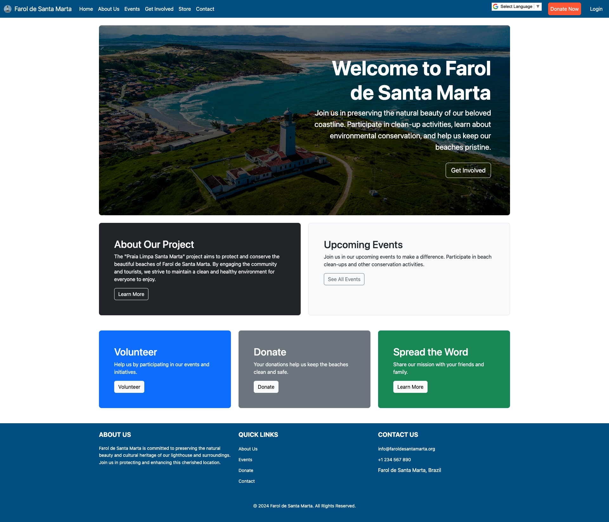

faroldesantamartaproject
========================

**Farol de Santa Marta App** is a Django-based platform designed to support environmental conservation efforts in the Farol de Santa Marta region. This platform enables users to participate in environmental conservation courses, provide feedback, purchase eco-friendly products, and contribute to community-driven sustainability initiatives.

Installation
------------

To install faroldesantamartaproject:

1. Install [pyenv](https://github.com/pyenv/pyenv-installer).

2. On a command prompt or terminal with your faroldesantamartaproject projects's directory as
   the current working directory, run the following commands:

   a. Install Python 3.12.2:

       pyenv install 3.12.2

   b. Create and activate a virtual environment:
   
       pyenv virtualenv 3.12.2 faroldesantamartaproject
       pyenv activate faroldesantamartaproject

   c. Install Django:

       pip install django

   d. Install django-bootstrap5:

       pip install django-bootstrap5

   e. Install Django REST framework:

       pip install djangorestframework

Usage
-----

To use faroldesantamartaproject:

1. On a command prompt or terminal with your faroldesantamartaproject projects's directory as
   the current working directory, run the following commands:

   a. Initialize the database and apply the initial migrations:

       python manage.py makemigrations
       python manage.py migrate

   b. Load the initial fixtures:

       python manage.py loaddata roles
       python manage.py loaddata users
       python manage.py loaddata statuses
       python manage.py loaddata courses
       python manage.py loaddata feedbacks
       python manage.py loaddata events
       python manage.py loaddata products
       

   c. Start the development server:

       python manage.py runserver

To test faroldesantamartaproject:

1. On a command prompt or terminal with your faroldesantamartaproject projects's directory as
   the current working directory, run the following command:

       python manage.py test
